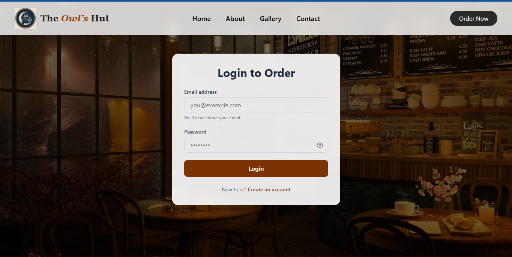
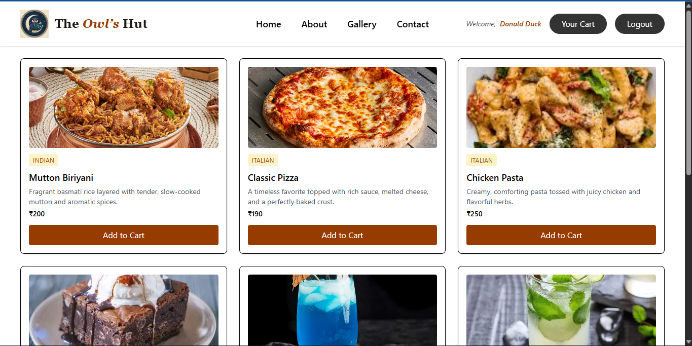
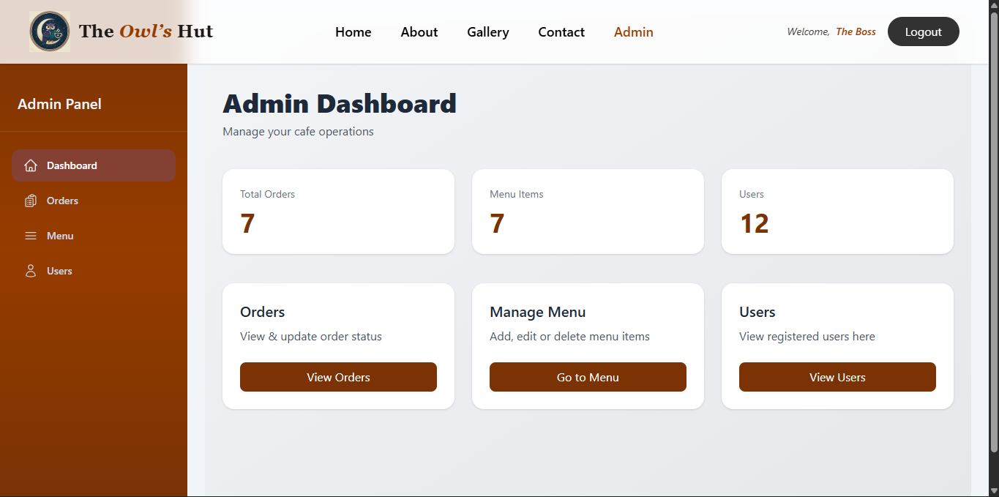

#  The Owl’s Hut — Full Stack Cafe Application

The Owl’s Hut is a full-stack cafe and coffee shop web application built using the **MERN stack**.  
It provides a seamless experience for users to browse the menu and place orders, while offering a powerful **admin dashboard** to manage menu items, users, and orders.

---

##  Project Overview

The Owl’s Hut is designed to simulate a real-world restaurant management system.  
The application is divided into two main parts:

- **Customer-facing interface** for browsing menu items
- **Admin panel** for managing restaurant operations

The project focuses on:
- Clean UI/UX
- Secure authentication
- Scalable backend architecture
- Real-world MERN stack practices

---

##  Features

###  User Features
- User authentication (Login / Signup)
- Browse menu items with images
- View item details (price, category, description)
- Place orders
- Responsive design for mobile & desktop

###  Admin Features
- Secure admin login
- Admin dashboard with statistics
- Add, edit, and delete menu items
- View all registered users
- View and manage orders
- Protected admin routes

---

##  Tech Stack

### Frontend
- **React**
- **Vite**
- **Tailwind CSS**
- **React Router DOM**
- **Axios**

### Backend
- **Node.js**
- **Express.js**
- **JWT Authentication**

### Database
- **MongoDB**
- **Mongoose**

---

##  Screenshots

> 
>
>
>

---

##  Live Application

https://cafewebsite-frontend.onrender.com

---

##  API Routes

### Authentication

| Method | Route                  | Description         |
| ------ | ---------------------- | ------------------- |
| POST   | `/api/auth/createuser` | Register a new user |
| POST   | `/api/auth/login`      | Login user / admin  |

### Users (Admin)

| Method | Route                    | Description   |
| ------ | ------------------------ | ------------- |
| GET    | `/api/admin/getallusers` | Get all users |

### Menu

| Method | Route           | Description               |
| ------ | --------------- | ------------------------- |
| GET    | `/api/menu`     | Get all menu items        |
| POST   | `/api/menu`     | Add new menu item (Admin) |
| PUT    | `/api/menu/:id` | Update menu item (Admin)  |
| DELETE | `/api/menu/:id` | Delete menu item (Admin)  |

### Orders

| Method | Route                         | Description            |
| ------ | ----------------------------- | ---------------------- |
| GET    | `/api/order/fetchorders`      | Get all orders (Admin) |
| PUT    | `/api/order/updatestatus/:id` | Update order status    |

---